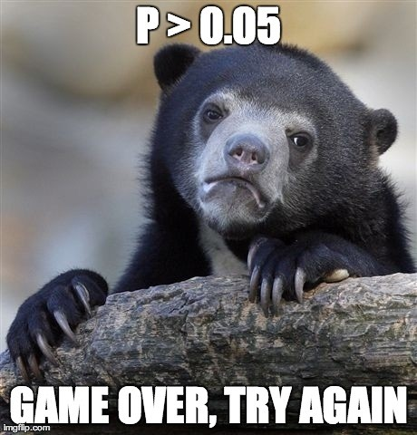

```{r set-options, echo=FALSE, cache=FALSE, message = FALSE}
knitr::opts_chunk$set(comment=NA)
options(width = 55)
```

## Today's R Setup

```{r, echo = FALSE, message = FALSE}
# install gganimate with 
# devtools::install_github('thomasp85/gganimate')

library(gganimate)

# install datasauRus from CRAN as usual

library(datasauRus)
```

```{r, message = FALSE}
library(knitr); library(broom); library(tidyverse)
```

and a couple of secrets, hidden for now.

# Visualizing Your Data

## 13 Data Sets (summarized) in the `d_long` tibble:

```{r, echo = FALSE}
dd <- datasaurus_dozen_wide

d_long <- datasaurus_dozen

d_long <- d_long %>%
  mutate(set = as.numeric(factor(dataset)))

d_long %>% group_by(set) %>%
  summarize(n = n(), mean_x = round(mean(x), 2), 
            sd_x = round(sd(x),1), 
            mean_y = round(mean(y), 2), 
            sd_y = round(sd(y),1), 
            cor(x, y)) %>%
   round(digits = 2)
```

## New Data: Model for Set 1

````{r}
set_1 <- lm(y ~ x, data = d_long %>% filter(set == 1))

tidy(set_1) %>% kable(digits = 2)

glance(set_1) %>%
  select(r.squared, adj.r.squared, sigma, p.value) %>%
  kable(digits = 3)
```

## New Data: Model for Set 2

````{r}
set_2 <- lm(y ~ x, data = d_long %>% filter(set == 2))

tidy(set_2) %>% kable(digits = 2)

glance(set_2) %>%
  select(r.squared, adj.r.squared, sigma, p.value) %>%
  kable(digits = 3)
```


## New Data: Model for Set 3

````{r}
set_3 <- lm(y ~ x, data = d_long %>% filter(set == 3))

tidy(set_3) %>% kable(digits = 2)

glance(set_3) %>%
  select(r.squared, adj.r.squared, sigma, p.value) %>%
  kable(digits = 3)
```

## All 13 Models, at a glance

```{r, echo = FALSE}
set_1 <- lm(y ~ x, data = d_long %>% filter(set == 1))
set_2 <- lm(y ~ x, data = d_long %>% filter(set == 2))
set_3 <- lm(y ~ x, data = d_long %>% filter(set == 3))
set_4 <- lm(y ~ x, data = d_long %>% filter(set == 4))
set_5 <- lm(y ~ x, data = d_long %>% filter(set == 5))
set_6 <- lm(y ~ x, data = d_long %>% filter(set == 6))
set_7 <- lm(y ~ x, data = d_long %>% filter(set == 7))
set_8 <- lm(y ~ x, data = d_long %>% filter(set == 8))
set_9 <- lm(y ~ x, data = d_long %>% filter(set == 9))
set_10 <- lm(y ~ x, data = d_long %>% filter(set == 10))
set_11 <- lm(y ~ x, data = d_long %>% filter(set == 11))
set_12 <- lm(y ~ x, data = d_long %>% filter(set == 12))
set_13 <- lm(y ~ x, data = d_long %>% filter(set == 13))

a1 <- glance(set_1) %>% mutate(dataset = 1)
a2 <- glance(set_2) %>% mutate(dataset = 2)
a3 <- glance(set_3) %>% mutate(dataset = 3)
a4 <- glance(set_4) %>% mutate(dataset = 4)
a5 <- glance(set_5) %>% mutate(dataset = 5)
a6 <- glance(set_6) %>% mutate(dataset = 6)
a7 <- glance(set_7) %>% mutate(dataset = 7)
a8 <- glance(set_8) %>% mutate(dataset = 8)
a9 <- glance(set_9) %>% mutate(dataset = 9)
a10 <- glance(set_10) %>% mutate(dataset = 10)
a11 <- glance(set_11) %>% mutate(dataset = 11)
a12 <- glance(set_12) %>% mutate(dataset = 12)
a13 <- glance(set_13) %>% mutate(dataset = 13)

a <- bind_rows(a1, a2, a3, a4, a5, a6, a7, a8, 
               a9, a10, a11, a12, a13) %>%
  mutate(sigma = round(sigma,2),
         p.value = round(p.value, 2),
         AIC = round(AIC, 0),
         BIC = round(BIC, 0)) %>%
  select(dataset, r.squared, adj.r.squared, sigma, 
         p.value, AIC, BIC) 

a %>% kable(digits = 3)
```

## Plot for Set 1 (code)

```{r, eval = FALSE}
d_long %>%
  filter(set == 1) %>%
  ggplot(., aes(x = x, y = y)) +
  geom_point() +
  theme_bw()
```

## Plot for Set 1 (result)

```{r, echo = FALSE}
d_long %>%
  filter(set == 1) %>%
  ggplot(., aes(x = x, y = y)) +
  geom_point() +
  theme_bw()
```

## https://xkcd.com/1725/


## Plot for Set 1 (with linear model and loess smooth)

```{r, echo = FALSE}
d_long %>%
  filter(set == 1) %>%
  ggplot(., aes(x = x, y = y)) +
  geom_point() +
  geom_smooth(method = "lm", col = "red") +
  geom_smooth(method = "loess", col = "blue", se = FALSE) +
  theme_bw()
```

- Added `geom_smooth(method = "lm", col = "red")` and 
- `geom_smooth(method = "loess", col = "blue", se = FALSE)`

## Residual Plots for Set 1 Model

```{r, echo = FALSE, fig.height = 7}
par(mfrow=c(2,2))
plot(set_1)
```

## Models 2-13

Models 2-13 all look about the same in terms of means, medians, correlations, regression models, but what happens if we plot the data?

```{r, eval = FALSE}
d_long %>%
  filter(set != 1) %>%
  ggplot(., aes(x = x, y = y)) +
  geom_point() +
  theme_bw() +
  facet_wrap(~ set, labeller = "label_both")
```

## The Other 12 Data Sets

```{r, fig.height = 6.8, echo = FALSE}
d_long %>%
  filter(set != 1) %>%
  ggplot(., aes(x = x, y = y)) +
  geom_point() +
  theme_bw() +
  facet_wrap(~ set, labeller = "label_both")
```

## Actually, each of these sets has a name

```{r, fig.height = 6.8, echo = FALSE}
d_long %>%
  filter(set != 1) %>%
  ggplot(., aes(x = x, y = y)) +
  geom_point() +
  theme_bw() +
  facet_wrap(~ dataset, labeller = "label_both")
```

## And a linear model yields the same fit for each

```{r, fig.height = 6.8, echo = FALSE}
d_long %>%
  filter(set != 1) %>%
  ggplot(., aes(x = x, y = y)) +
  geom_point() +
  geom_smooth(method = "lm", col = "red") +
  theme_bw() +
  facet_wrap(~ dataset, labeller = "label_both")
```

## And a loess smooth?

```{r, fig.height = 6.8, echo = FALSE}
d_long %>%
  filter(set != 1) %>%
  ggplot(., aes(x = x, y = y)) +
  geom_point() +
  geom_smooth(method = "loess", col = "blue", se = FALSE) +
  theme_bw() +
  facet_wrap(~ dataset, labeller = "label_both", 
             scales = "free_y")
```


## And the data come from

These are the datasauRus dozen data sets, available in the `datasauRus` package, which you can install from CRAN.

```
library(datasauRus)
d_long <- datasaurus_dozen
```

## A cool thing, available online...

Visit https://r-mageddon.netlify.com/post/reanimating-the-datasaurus/

```{r, eval = FALSE}
library(datasauRus)
library(ggplot2)
library(gganimate)

ggplot(datasaurus_dozen, aes(x=x, y=y))+
  geom_point()+
  theme_minimal() +
  transition_states(dataset, 3, 1)
```


---


# p Hacking and "Researcher Degrees of Freedom"

## Hack Your Way To Scientific Glory

https://fivethirtyeight.com/features/science-isnt-broken


## What can you get?

I was able to get 

- *p* < 0.01 (positive effect of Democrats on economy)
- *p* = 0.01 (negative effect of Democrats)
- *p* = 0.03 (negative effect of Democrats)
- *p* = 0.03 (positive effect of Democrats)

but also ...

- *p* = 0.05, 0.06, 0.07, 0.09, 0.17, 0.19, 0.20, 0.22, 0.23, 0.47, 0.51

without even switching parties, exclusively by changing my definitions of terms (section 2 of the graphic.)

## "Researcher Degrees of Freedom", 1

> [I]t is unacceptably easy to publish "statistically significant" evidence consistent with any hypothesis.

> The culprit is a construct we refer to as **researcher degrees of freedom**. In the course of collecting and analyzing data, researchers have many decisions to make: Should more data be collected? Should some observations be excluded? Which conditions should be combined and which ones compared? Which control variables should be considered? Should specific measures be combined or transformed or both?

Simmons et al. [$\textcolor{blue}{link}$](http://journals.sagepub.com/doi/abs/10.1177/0956797611417632) 

## "Researcher Degrees of Freedom", 2

> ... It is rare, and sometimes impractical, for researchers to make all these decisions beforehand. Rather, it is common (and accepted practice) for researchers to explore various analytic alternatives, to search for a combination that yields statistical significance, and to then report only what worked. The problem, of course, is that the likelihood of at least one (of many) analyses producing a falsely positive finding at the 5% level is necessarily greater than 5%.

For more, see 

- Gelman's blog [$\textcolor{blue}{2012-11-01}$](http://andrewgelman.com/2012/11/01/researcher-degrees-of-freedom/) "Researcher Degrees of Freedom", 
- Paper by [$\textcolor{blue}{Simmons}$](http://journals.sagepub.com/doi/abs/10.1177/0956797611417632) and others, defining the term.

## And this is really hard to deal with...

**The garden of forking paths**: Why multiple comparisons can be a problem, even when there is no fishing expedition or p-hacking and the research hypothesis was posited ahead of time

> Researcher degrees of freedom can lead to a multiple comparisons problem, even in settings
where researchers perform only a single analysis on their data. The problem is there can be a
large number of potential comparisons when the details of data analysis are highly contingent on
data, without the researcher having to perform any conscious procedure of fishing or examining
multiple p-values. We discuss in the context of several examples of published papers where
data-analysis decisions were theoretically-motivated based on previous literature, but where the
details of data selection and analysis were not pre-specified and, as a result, were contingent on
data.

- [$\textcolor{blue}{Link}$](http://www.stat.columbia.edu/~gelman/research/unpublished/p_hacking.pdf) to the paper from Gelman and Loken

## Benjamin et al 2017 Redefine Statistical Significance

We propose to change the default P-value threshold for statistical significance for claims of new discoveries from 0.05 to 0.005.

- 0.005 is stringent enough to "break" the current system - makes it very difficult for researchers to reach threshold with noisy, useless studies.

Visit the main [$\textcolor{blue}{article}$](https://psyarxiv.com/mky9j/). Visit an explanatory piece in [$\textcolor{blue}{Science}$](http://www.sciencemag.org/news/2017/07/it-will-be-much-harder-call-new-findings-significant-if-team-gets-its-way).

### Lakens et al. Justify Your Alpha

"In response to recommendations to redefine statistical significance to $p \leq .005$, we propose that researchers should transparently report and justify all choices they make when designing a study, including the alpha level." Visit [$\textcolor{blue}{link}$](https://psyarxiv.com/9s3y6).

---



## Why not post hoc power analysis?

So you collected data and analyzed the results. Now you want to do an after data gathering (post hoc) power analysis.

1. What will you use as your "true" effect size? 
    - Often, point estimate from data - yuck - results very misleading - power is generally seriously overestimated when computed on the basis of statistically significant results.
    - Much better (but rarer) to identify plausible effect sizes based on external information rather than on your sparkling new result.
2. What are you trying to do? (too often)
    - get researcher off the hook (I didn't get p < 0.05 because I had low power - an alibi to explain away non-significant findings) or
    - encourage overconfidence in the finding.

## The Impact of Study Design (Gelman)

Applied statistics is hard. 

- Doing a statistical analysis is like playing basketball, or knitting a sweater. You can get better with practice.
- Incompetent statistics does not necessarily doom a research paper: some findings are solid enough that they show up even when there are mistakes in the data collection and data analyses. But we've also seen many examples where incompetent statistics led to conclusions that made no sense but still received publication and publicity.
- We should be thinking not just about data analysis, but also data quality.

---


# So, what have we learned so far?

## The Signal and The Noise

- Nature's laws do not change very much.
- There is no reason to conclude that the affairs of men are becoming more predictable. The opposite may well be true.

Thinking Probabilistically, and using the Bayesian way of thinking about prediction

- Don't fall into the comforting trap of binary thinking. Expressions of uncertainty are not admissions of weakness.
- Know Where You're Coming From - state explicitly how likely we believe an event is to occur *before* we begin to weigh the evidence.
- The volume of information is increasing exponentially. But the signal-to-noise ratio may be waning. We need better ways of distinguishing the two.

Our bias is to think that we are better at prediction than we really are.

## Ten Simple Rules for Effective Statistical Practice

From *PLoS Comput Biol* [$\textcolor{blue}{link}$](http://journals.plos.org/ploscompbiol/article?id=10.1371/journal.pcbi.1004961)

1. Statistical Methods Should Enable Data to Answer Scientific Questions
2. Signals Always Come with Noise
3. Plan Ahead, Really Ahead
4. Worry About Data Quality
5. Statistical Analysis Is More Than a Set of Computations
6. Keep it Simple
7. Provide Assessments of Variability
8. Check Your Assumptions
9. When Possible, Replicate!
10. Make Your Analysis Reproducible

## On Planning Ahead - Way Ahead...

"To consult the statistician after an experiment is finished is often merely to ask him to conduct a post mortem examination. He can perhaps say what the experiment died of."

- Sir Ronald Fisher

## Build Tidy Data Sets

- Each variable you measure should be in one column.
- Each different observation of that variable should be in a different row.
- There should be one table for each "kind" of variable.
- If you have multiple tables, they should include a column in the table that allows them to be linked.
- Include a row at the top of each data table that contains real row names. `Age_at_Diagnosis` is a much much better name than `ADx`.
- Build useful codebooks.

Jeff Leek: "How to share data with a statistician" [$\textcolor{blue}{link}$](https://github.com/jtleek/datasharing)

## A Most Important Tip (@drob)


## The Course So Far

1. Statistics is too important to be left to statisticians.
2. Models and visualization are the big takeaways, but don't forget about methods for making statistical inferences.
3. Reproducible research is the current wave. 
4. Things are changing quickly. We live in interesting times.

### What about 432?

What do you want to know?

---


