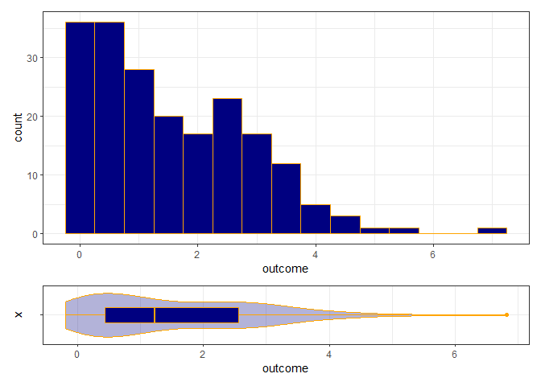

Will a Logarithmic Transformation work for these data?
================

``` r
p1 <- ggplot(sample_data, aes(x = outcome)) +
    geom_histogram(binwidth = 0.5, fill = "navy", col = "orange")
p2 <- ggplot(sample_data, aes(x = "", y = outcome)) +
    geom_violin(alpha = 0.3, fill = "navy", col = "orange") +
    geom_boxplot(width = 0.3, fill = "navy", col = "orange") + 
    coord_flip()

p1 + p2 + plot_layout(ncol = 1, heights = c(4,1))
```

<!-- -->

``` r
mosaic::favstats(~ outcome, data = sample_data)
```

    ##         min        Q1   median       Q3     max     mean       sd   n missing
    ##  -0.1893055 0.4457745 1.227208 2.562338 6.82176 1.556977 1.342386 200       0

What should we do about this?
