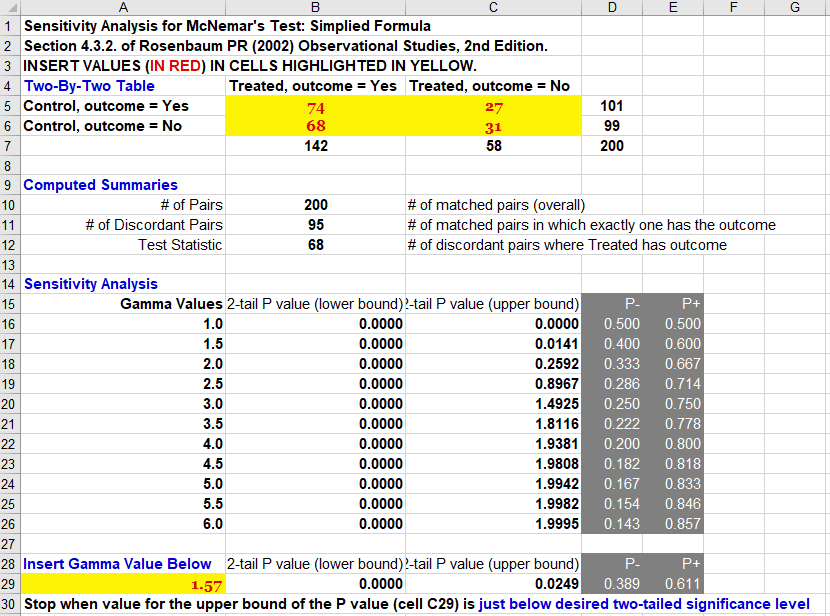
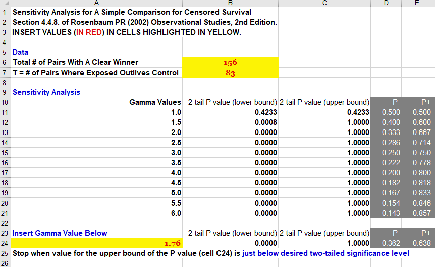

```{r setup, include=FALSE}
knitr::opts_chunk$set(comment=NA)
options(width = 60)
```

# Running Sensitivity Analyses 

## Setup

```{r packages and data, message=FALSE}
library(knitr)
library(Matching)
library(rbounds)
library(janitor)
library(tidyverse)
```

## Idealized Standards for a Sensitivity Evaluation

- Logic, Theory and Empirical Evidence
- "It is unlikely that a non-huge hidden bias would substantially change our conclusions"
    - Measured and incorporated every major known factor that we could identify.
    - Effects on health outcomes were generally large, consistent with earlier work and clinically plausible.

An omitted variable is most likely to change our conclusions about the exposure if it is

- closely related to the outcome,
- seriously imbalanced by exposure,
- uncorrelated with the propensity score.

## The Design Sensitivity Parameter $\Gamma$

$\Gamma$ measures degree of departure from a study that is free of hidden bias.  A sensitivity analysis will consider possible values of $\Gamma$ and show how the inference might change.  

- $\Gamma$ describes the odds ratio comparing the odds of being selected for treatment for two units who are similar on all observed covariates.
    - If $\Gamma$ = 1, this means that the study is free of hidden bias 
        - Subjects with the same observed covariates have the same odds (hence same probability) of  exposure. 
    - If $\Gamma$ = 2, then two units who appear similar, who have the same set of observed covariates **X**, could differ in their odds of receiving the treatment by as much as a factor of 2, so that one could be twice as likely as the other to receive the exposure.

## Relating $\Gamma$ to Sensitivity Statements

A study is **sensitive** if values of $\Gamma$ close to 1 could lead to inferences that are very different from those obtained assuming the study is free of hidden bias.  

- A study is *insensitive* if extreme values of $\Gamma$ are required to alter the inference.

> "To attribute the (observed significant) outcome to an unobserved covariate rather than to the treatment, that unobserved covariate has to increase the odds of treatment by a factor of $\Gamma$, and also predict our outcome quite well."

# Estimating $\Gamma$ in a Simulated Situation

## A Simulated Data Set

```{r, message = FALSE}
sim_obs <- read_csv("data/sim_sens_2020.csv") %>% clean_names()
sim_obs
```

## `sim_obs` data

```{r, message = FALSE}
mosaic::inspect(sim_obs)
```

## Study A: A Binary Outcome

```{r}
sim_obs %>% tabyl(treatment, out_binary) %>% 
    adorn_totals() %>%
    adorn_percentages() %>%
    adorn_pct_formatting() %>%
    adorn_ns(position = "front")
```

summary(sim_obs)

## Binary Outcome (1:1 Match)

```{r}
set.seed(500)
m.obj <- Match(Y = sim_obs$out_binary, 
               Tr = as.logical(sim_obs$treatment), 
               X = sim_obs$propensity, 
               M = 1, replace = FALSE)
```

Why set a seed? Because if you don't, the match can change on you (tied propensity scores...)

---

```{r}
summary(m.obj)
```

## Estimating $\Gamma$ with `binarysens`

```{r}
binarysens(m.obj, Gamma = 2.5, GammaInc = 0.25)
```

## Making our $\Gamma$ Estimate more precise: `binarysens`

```{r}
binarysens(m.obj, Gamma = 1.75, GammaInc = 0.05)$bounds %>%
  tbl_df() %>% slice(11:17)
```

## Obtaining the Matched Sample

If we wanted to use the spreadsheet software to calculate $\Gamma$, we'd need the matched sample.

```{r}
matches <- factor(rep(m.obj$index.treated, 2))

sim.matchedsample1 <- 
  cbind(matches, 
        sim_obs[c(m.obj$index.control, 
                  m.obj$index.treated),]) %>%
  arrange(matches)
```

## The Matched Sample

```{r}
head(sim.matchedsample1)
```

## Building a 2x2 table from the Matched Sample

```{r}
tmp <- sim.matchedsample1 %>% 
  mutate(res = 10*treatment + out_binary) %>%
    group_by(matches) %>%
    summarize(out.treated = out_binary[2], 
              out.control = out_binary[1]) 
```

```{r}
tmp %>% tabyl(out.control, out.treated) %>% adorn_title()
```

## What would we put into the spreadsheet?

So our 2x2 table would be:

2x2 Table         | Treated has `out1` | Treated no `out1`
----------------: | ---------------: | --------------:
Control has `out1`  | `r (tmp %>% count(out.treated, out.control) %>% mutate(res = 1:4) %>% filter(res == 4) %>% select(n) -> a)` | `r (tmp %>% count(out.treated, out.control) %>% mutate(res = 1:4) %>% filter(res == 2) %>% select(n) -> c)`
Control no `out1`   | `r (tmp %>% count(out.treated, out.control) %>% mutate(res = 1:4) %>% filter(res == 3) %>% select(n) -> b)` | `r (tmp %>% count(out.treated, out.control) %>% mutate(res = 1:4) %>% filter(res == 1) %>% select(n) -> d)`

In our `r a + b + c + d` matched pairs, we have `r b + c` pairs in the off-diagonal. There are `r b` pairs where only the treated subject has the outcome. Assuming no hidden bias, we calculate an approximate 95% confidence interval for the McNemar odds ratio (which is 68/27 or `r round(68/27,2)`) with

```{r}
ci.p <- prop.test(x = 68, n = 68+27)$conf
ci.odds <- ci.p/(1 - ci.p)
ci.odds
```

OK. So what are the Sensitivity Spreadsheet (**2008**) Results?

---



## OK, so let's say $\Gamma$ is about 1.6. What next?

Assuming no hidden bias, the propensity-matched result describes a strong relationship (McNemar odds ratio = 2.52, with 95% CI (1.58, 4.03)) between treatment receipt and our binary outcome.

To attribute the higher rate of our binary outcome to an unobserved covariate rather than to the effect of our treatment, that unobserved covariate would need to produce more than a 60% increase (or a $\Gamma$ = 1.6-fold increase) in the odds of receiving the treatment, and be a very strong predictor of the binary outcome.

## Study B: A Quantitative Outcome

```{r}
set.seed(500)
m.obj2 <- Match(Y = sim_obs$out_quant, 
               Tr = as.logical(sim_obs$treatment), 
               X = sim_obs$propensity, 
               M = 1, replace = FALSE)
```

## Estimate from `Matching` of Treatment Effect

```{r}
summary(m.obj2)
```

## Using `psens` to estimate $\Gamma$

```{r}
psens(m.obj2, Gamma = 3, GammaInc = 0.25)
```

## Refining our $\Gamma$ estimate

```{r}
psens(m.obj2, Gamma = 2, GammaInc = 0.05)$bounds %>%
  tbl_df() %>% slice(13:18)
```

## Rosenbaum Bounds for Hodges-Lehmann Point Estimate

```{r}
hlsens(m.obj2, pr = 0.1, Gamma = 2.5, GammaInc = 0.25)
```

## Study C: Survival (Time to Event) Outcome

For the spreadsheet, we need to identify the number of pairs with a clear winner, and the number of those "clear winner" pairs where the winner is the "treatment = 1" subject. 

```{r}
match3 <- sim.matchedsample1 %>% tbl_df() %>%
  select(matches, treatment, censored, out_time, 
         subject, propensity) %>%
  arrange(matches, -treatment)

head(match3, 2)
```

## Determining "Clear Winners" (1)

**What if there is no censoring?**

```{r}
match3 %>% filter(matches %in% c(302, 308))
```

- Which subject in match 302 has the longer `out_time`?
- Which subject in match 308 has the longer `out_time`?
- Will we have a clear winner if neither subject's time is censored?

## Determining "Clear Winners" (2)

**What if both subjects in the pair are censored?**

```{r}
match3 %>% filter(matches == 310)
```

- Which subject in match 310 has the longer `out_time`?
- Will we have a clear winner if both subjects' time is censored?

## Determining "Clear Winners" (3)

**What if only the treated subject in the pair is censored?**

```{r}
match3 %>% filter(matches %in% c(301, 307))
```

- Which subject in match 301 has the longer `out_time`?
- Which subject in match 307 has the longer `out_time`?
- Will we have a clear winner if exactly one subject's time is censored?

## Determining "Clear Winners" (4)

**What if only the control subject in the pair is censored?**

```{r}
match3 %>% filter(matches %in% c(305, 337))
```

- Which subject in match 305 has the longer `out_time`?
- Which subject in match 337 has the longer `out_time`?
- How do we know if we will have a clear winner if exactly one subject's time is censored?

## Getting the Counts for the Spreadsheet

```
write_csv(match3, "data/match3.csv")
```

Across our 200 matches, I hand-counted the number of clear winners, and in each case, who wins. This is certainly an area where a more patient programmer could do the job faster.

- If both treated and control are censored, no clear winner (2 pairs)
- If both treated and control are NOT censored, clear winner (134 pairs) unless there is a tie (0 pairs)
    - In 73 of those 134 pairs, the treated subject had the longer `out_time`.
- If either treated or control is censored but not both, then there is a clear winner only if the censored subject had the longer `out_time`.
    - 10 pairs where treated subject clearly wins despite being censored.
    - 12 pairs where control subject clearly wins despite being censored.

So, in total, we have 134 + 10 + 12 = 156 pairs with a clear winner. In 83 of those, the treated subject had the longer `out_time`.

## Result from the Spreadsheet



## What if it had been 113 out of 156 instead?


## Summary: Sensitivity Analysis

Hidden bias is the great problem with observational studies, and with PS models.

- Sensitivity analysis after matching can be applied in many scenarios.
- We hope to find that an unobserved covariate would have to be very powerful to alter our conclusions.
- That doesn't mean that such a covariate (or set of them) doesn't exist.

## Our PS "Formula" for the Heart Failure papers

1. Identify available data related to selection for the exposure, and to risk for the outcome.
2. Demonstrate need for PS modeling (imbalance in key characteristics), and evaluate PS balance after matching, usually through standardized difference plots (usually significance, too, unfortunately.)
3. Model exposure effect (Cox models stratified by matched pair identifiers, typically.)
4. Formal sensitivity analysis **if** effect is significant.

