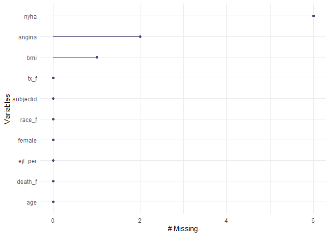
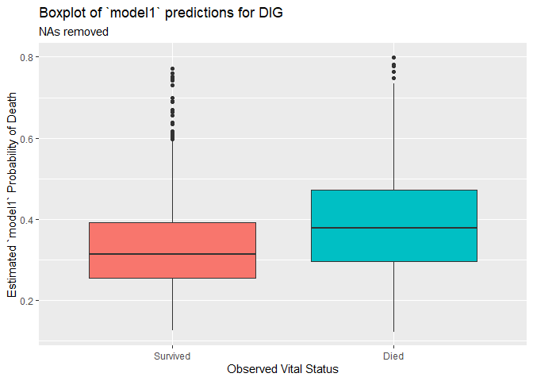
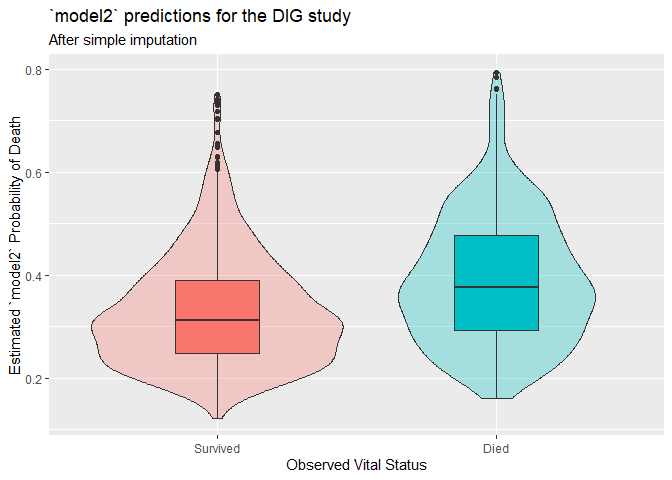

500 Homework 1 Answer Sketch
================
Thomas E. Love
due 2020-01-23 (version: 2020-01-23)

  - [Task 1](#task-1)
  - [Task 2](#task-2)
  - [Task 3](#task-3)
      - [The Problem](#the-problem)
      - [Setup, Packages, Data Ingest](#setup-packages-data-ingest)
      - [Preparing the Sample for
        Modeling](#preparing-the-sample-for-modeling)
      - [Initial Data Summaries](#initial-data-summaries)
      - [A “Complete Cases” Analysis and Training/Test
        Partition](#a-complete-cases-analysis-and-trainingtest-partition)
          - [Fitting a Logistic Regression Model to the training
            sample](#fitting-a-logistic-regression-model-to-the-training-sample)
          - [Applying the model to a test sample, and producing a
            graph](#applying-the-model-to-a-test-sample-and-producing-a-graph)
      - [What if we instead dealt with missingness via single
        imputation?](#what-if-we-instead-dealt-with-missingness-via-single-imputation)
          - [Fitting a Logistic Regression Model to the training
            sample](#fitting-a-logistic-regression-model-to-the-training-sample-1)
          - [Applying the model to a test sample, and producing a
            graph](#applying-the-model-to-a-test-sample-and-producing-a-graph-1)

# Task 1

Task 1 requires you to request the DIG data.

# Task 2

In task 2 you were asked to build a mock proposal for a DIG
observational study. We’ll discuss those in class, and so I have no real
sketch here. I expect that some of Rosenbaum’s writing will be of help.
The questions you needed to answer were:

1.  What comparison do you want to make? (Select a comparison different
    than the one made in the original DIG paper)
      - Did patients receiving “EXPOSURE A” have lower rates of “BAD
        OUTCOME” than those who received “EXPOSURE B”?
2.  Why is this of interest?
      - “OUTCOME” is important because …
      - “EXPOSURE” (A or B) is important because …
      - (*Be sure to clearly indicate what you hypothesize the effect of
        EXPOSURE on OUTCOME to be.*)
3.  What are the key measures - specifically, the exposure/treatment,
    the primary outcome, and important covariates that are available in
    the data to help address your question of interest?
      - Exposure/Treatment = A or B, and be sure to specify the way in
        which you will know which exposure someone receives, and whether
        the exposure / treatment is applied using a randomized approach,
        or not.
      - Outcome = …, and be sure to specify the variables you will use
        to determine the outcome, as well as the *type* of outcome, be
        it continuous, categorical (and if categorical, binary or
        multi-categorical) or survival (and if survival, is censoring
        involved?)
      - Covariates of interest: We’d be interested in anything related
        to treatment choice or to outcome. You should provide a list of
        such variables of interest. Remember to include **ONLY** things
        which are measured prior to the exposure/treatment of interest,
        or which are not possibly changed by it.

# Task 3

## The Problem

Here, you were to build and evaluate a logistic regression model using
the DIG data.

Your model should be fitted to a random training sample of 5,000
subjects (be sure to specify the seed you used to select that sample)
and then tested on the remaining 1,800 subjects, but you’ll probably
want to check for and deal with missingness in the entire sample before
splitting into training and test groups. Your model will predict the
probability that a subject in the study will die, based on:

  - the subject’s assigned treatment (digoxin or placebo),
  - the subject’s age at randomization,
  - race,
  - sex,
  - ejection fraction (percent),
  - calculated body mass index,
  - NYHA functional class, and
  - whether or not the subject currently has angina.

The relevant variables in the `dig1.csv` data set are therefore:
`subjectid`, `DEATH`, `TRTMT`, `AGE`, `RACE`, `SEX`, `EJF_PER`, `BMI`,
`FUNCTCLS`, and `ANGINA`.

Be sure to treat the categorical variables (including NYHA class, angina
status, race and sex) appropriately as factors (ideally with meaningful
names), and account for missingness deliberately in an appropriate way.

Your final results should include:

1.  a R Markdown file containing all of your code
2.  an HTML file with the results from your Markdown, which describes:
    1.  your sample preparation work including dealing with missingness
        and partitioning the data into training and test samples
    2.  your fitted logistic regression model (to your training sample)
    3.  the results of your application of your model to your test
        sample, which is best accomplished as a graph which shows the
        distribution of your model probability estimates in the
        “actually died” and “actually survived” groups within your
        test sample.

## Setup, Packages, Data Ingest

``` r
library(skimr); library(broom); 
library(simputation); library(naniar); library(here)
library(magrittr); library(janitor); library(tidyverse)

dig1 <- read_csv(here("data/dig1.csv")) %>% 
  clean_names()

dig1
```

    # A tibble: 6,800 x 72
       subjectid trtmt   age  race   sex ejf_per ejfmeth chestx   bmi klevel creat
           <dbl> <dbl> <dbl> <dbl> <dbl>   <dbl>   <dbl>  <dbl> <dbl>  <dbl> <dbl>
     1         1     0    66     1     1      40       2   0.5   20.1   NA   1.26 
     2         2     0    77     1     1      12       1   0.56  20.7    3.1 1.5  
     3         3     0    72     1     2      36       1   0.68  25.5    5.1 1.24 
     4         4     1    57     1     1      31       1   0.48  25.8   NA   2.25 
     5         5     0    74     1     1      15       1   0.53  25.7    4   1.47 
     6         6     0    69     2     2      45       1   0.7   27.8    4.3 1.2  
     7         7     1    64     1     2      30       1   0.52  31.7    4.3 1.3  
     8         8     1    60     2     1      39       1   0.4   25.1    5.1 1    
     9         9     0    74     2     1      33       3   0.49  23.7    4.7 0.977
    10        10     1    64     1     2      24       1   0.52  28.7    4   1.93 
    # ... with 6,790 more rows, and 61 more variables: digdoser <dbl>,
    #   chfdur <dbl>, rales <dbl>, elevjvp <dbl>, pedema <dbl>, restdys <dbl>,
    #   exertdys <dbl>, actlimit <dbl>, s3 <dbl>, pulcong <dbl>, nsym <dbl>,
    #   heartrte <dbl>, diabp <dbl>, sysbp <dbl>, functcls <dbl>, chfetiol <dbl>,
    #   prevmi <dbl>, angina <dbl>, diabetes <dbl>, hyperten <dbl>, diguse <dbl>,
    #   diuretk <dbl>, diuret <dbl>, ksupp <dbl>, aceinhib <dbl>, nitrates <dbl>,
    #   hydral <dbl>, vasod <dbl>, digdose <dbl>, cvd <dbl>, cvddays <dbl>,
    #   whf <dbl>, whfdays <dbl>, dig <dbl>, digdays <dbl>, mi <dbl>, midays <dbl>,
    #   uang <dbl>, uangdays <dbl>, strk <dbl>, strkdays <dbl>, sva <dbl>,
    #   svadays <dbl>, vena <dbl>, venadays <dbl>, crev <dbl>, crevdays <dbl>,
    #   ocvd <dbl>, ocvddays <dbl>, rinf <dbl>, rinfdays <dbl>, oth <dbl>,
    #   othdays <dbl>, hosp <dbl>, hospdays <dbl>, nhosp <dbl>, death <dbl>,
    #   deathday <dbl>, reason <dbl>, dwhf <dbl>, dwhfdays <dbl>

## Preparing the Sample for Modeling

``` r
dig_hw1 <- dig1 %>%
    mutate(nyha = factor(functcls),
           female = sex - 1,
           race_f = fct_recode(factor(race), 
                               "White" = "1",
                               "Non-White" = "2"),
           tx_f = fct_recode(factor(trtmt), 
                                    "Placebo" = "0",
                                    "Treatment" = "1"),
           death_f = fct_recode(factor(death),
                                "Died" = "1",
                                "Survived" = "0")) %>%
    select(subjectid, death_f, tx_f, age, race_f, female,
           ejf_per, bmi, nyha, angina)
```

## Initial Data Summaries

OK. What do we have now?

``` r
skim(dig_hw1 %>% select(-subjectid))
```

|                                                  |                              |
| :----------------------------------------------- | :--------------------------- |
| Name                                             | dig\_hw1 %\>% select(-subje… |
| Number of rows                                   | 6800                         |
| Number of columns                                | 9                            |
| \_\_\_\_\_\_\_\_\_\_\_\_\_\_\_\_\_\_\_\_\_\_\_   |                              |
| Column type frequency:                           |                              |
| factor                                           | 4                            |
| numeric                                          | 5                            |
| \_\_\_\_\_\_\_\_\_\_\_\_\_\_\_\_\_\_\_\_\_\_\_\_ |                              |
| Group variables                                  | None                         |

Data summary

**Variable type: factor**

| skim\_variable | n\_missing | complete\_rate | ordered | n\_unique | top\_counts                      |
| :------------- | ---------: | -------------: | :------ | --------: | :------------------------------- |
| death\_f       |          0 |              1 | FALSE   |         2 | Sur: 4425, Die: 2375             |
| tx\_f          |          0 |              1 | FALSE   |         2 | Pla: 3403, Tre: 3397             |
| race\_f        |          0 |              1 | FALSE   |         2 | Whi: 5809, Non: 991              |
| nyha           |          6 |              1 | FALSE   |         4 | 2: 3664, 3: 2081, 1: 907, 4: 142 |

**Variable type: numeric**

| skim\_variable | n\_missing | complete\_rate |  mean |    sd |    p0 |   p25 |  p50 |  p75 |  p100 | hist  |
| :------------- | ---------: | -------------: | ----: | ----: | ----: | ----: | ---: | ---: | ----: | :---- |
| age            |          0 |              1 | 63.48 | 10.92 | 21.00 | 57.00 | 65.0 | 71.0 | 94.00 | ▁▂▆▇▁ |
| female         |          0 |              1 |  0.22 |  0.42 |  0.00 |  0.00 |  0.0 |  0.0 |  1.00 | ▇▁▁▁▂ |
| ejf\_per       |          0 |              1 | 28.54 |  8.85 |  3.00 | 22.00 | 29.0 | 35.0 | 45.00 | ▁▃▇▇▅ |
| bmi            |          1 |              1 | 27.11 |  5.19 | 14.45 | 23.68 | 26.5 | 29.8 | 62.66 | ▃▇▁▁▁ |
| angina         |          2 |              1 |  0.27 |  0.44 |  0.00 |  0.00 |  0.0 |  1.0 |  1.00 | ▇▁▁▁▃ |

Or, another way to see the counts of missing data:

``` r
dig_hw1 %>% map_dbl(~ sum(is.na(.)))
```

    subjectid   death_f      tx_f       age    race_f    female   ejf_per       bmi 
            0         0         0         0         0         0         0         1 
         nyha    angina 
            6         2 

Or, from the `naniar` package (see
<http://naniar.njtierney.com/articles/getting-started-w-naniar.html>),
we have:

``` r
gg_miss_var(dig_hw1)
```

<!-- -->

Which observations are affected?

``` r
dig_hw1 %>% filter(!complete.cases(.)) %>%
    select(subjectid, bmi, nyha, angina)
```

    # A tibble: 9 x 4
      subjectid   bmi nyha  angina
          <dbl> <dbl> <fct>  <dbl>
    1       288  20.1 <NA>       0
    2       576  22.1 2         NA
    3      1172  22.2 2         NA
    4      2432  25.6 <NA>       0
    5      4941  NA   1          0
    6      5315  28.7 <NA>       0
    7      5549  28.7 <NA>       0
    8      6360  29.1 <NA>       0
    9      6417  47.0 <NA>       0

## A “Complete Cases” Analysis and Training/Test Partition

With so few missing values, a completely reasonable strategy would be to
simply omit the missing data before splitting into training and test
samples.

``` r
dig_hw1_noNA <- dig_hw1 %>% drop_na()

set.seed(20200123)
dig_hw1_train <- sample_n(dig_hw1_noNA, size = 5000)
dig_hw1_test <- anti_join(dig_hw1_noNA, dig_hw1_train)
```

    Joining, by = c("subjectid", "death_f", "tx_f", "age", "race_f", "female",
    "ejf_per", "bmi", "nyha", "angina")

Any missingness left that we missed?

``` r
colSums(is.na(dig_hw1_train))
```

    subjectid   death_f      tx_f       age    race_f    female   ejf_per       bmi 
            0         0         0         0         0         0         0         0 
         nyha    angina 
            0         0 

``` r
colSums(is.na(dig_hw1_test))
```

    subjectid   death_f      tx_f       age    race_f    female   ejf_per       bmi 
            0         0         0         0         0         0         0         0 
         nyha    angina 
            0         0 

### Fitting a Logistic Regression Model to the training sample

``` r
model1 <- glm(death_f ~ tx_f + age + race_f + female + 
                  ejf_per + bmi + nyha + angina, 
              family = binomial(link = "logit"),
              data = dig_hw1_train)

summary(model1)
```

``` 

Call:
glm(formula = death_f ~ tx_f + age + race_f + female + ejf_per + 
    bmi + nyha + angina, family = binomial(link = "logit"), data = dig_hw1_train)

Deviance Residuals: 
    Min       1Q   Median       3Q      Max  
-1.8213  -0.9209  -0.7492   1.2702   1.9484  

Coefficients:
                 Estimate Std. Error z value Pr(>|z|)    
(Intercept)      0.345867   0.279677   1.237   0.2162    
tx_fTreatment    0.028091   0.061129   0.460   0.6458    
age             -0.003626   0.002779  -1.305   0.1921    
race_fNon-White  0.017303   0.086089   0.201   0.8407    
female          -0.158081   0.075196  -2.102   0.0355 *  
ejf_per         -0.034228   0.003568  -9.594  < 2e-16 ***
bmi             -0.006513   0.005864  -1.111   0.2667    
nyha2            0.289004   0.100950   2.863   0.0042 ** 
nyha3            0.852775   0.106562   8.003 1.22e-15 ***
nyha4            1.720428   0.239499   7.183 6.80e-13 ***
angina          -0.163419   0.069900  -2.338   0.0194 *  
---
Signif. codes:  0 '***' 0.001 '**' 0.01 '*' 0.05 '.' 0.1 ' ' 1

(Dispersion parameter for binomial family taken to be 1)

    Null deviance: 6475.7  on 4999  degrees of freedom
Residual deviance: 6188.1  on 4989  degrees of freedom
AIC: 6210.1

Number of Fisher Scoring iterations: 4
```

``` r
glance(model1)
```

    # A tibble: 1 x 7
      null.deviance df.null logLik   AIC   BIC deviance df.residual
              <dbl>   <int>  <dbl> <dbl> <dbl>    <dbl>       <int>
    1         6476.    4999 -3094. 6210. 6282.    6188.        4989

### Applying the model to a test sample, and producing a graph

``` r
dig_hw1_test$.fit <- predict(model1, newdata = dig_hw1_test, type = "response")

ggplot(dig_hw1_test, aes(x = death_f, y = .fit, fill = death_f)) +
  geom_boxplot() + 
  guides(fill = FALSE) +
  labs(y = "Estimated `model1` Probability of Death", 
       x = "Observed Vital Status",
       title = "Boxplot of `model1` predictions for DIG",
      subtitle = "NAs removed")
```

<!-- -->

## What if we instead dealt with missingness via single imputation?

As an alternative, the use of single imputation might work well, too.
I’ll show you a single imputation approach, making use of the
`simputation` [package](https://github.com/markvanderloo/simputation),
which is a good tool for single imputation, and has [a nice vignette
here](https://cran.r-project.org/web/packages/simputation/vignettes/intro.html).

``` r
str(dig_hw1)
```

    Classes 'spec_tbl_df', 'tbl_df', 'tbl' and 'data.frame':    6800 obs. of  10 variables:
     $ subjectid: num  1 2 3 4 5 6 7 8 9 10 ...
     $ death_f  : Factor w/ 2 levels "Survived","Died": 1 2 1 1 1 1 2 1 1 1 ...
     $ tx_f     : Factor w/ 2 levels "Placebo","Treatment": 1 1 1 2 1 1 2 2 1 2 ...
     $ age      : num  66 77 72 57 74 69 64 60 74 64 ...
     $ race_f   : Factor w/ 2 levels "White","Non-White": 1 1 1 1 1 2 1 2 2 1 ...
     $ female   : num  0 0 1 0 0 1 1 0 0 1 ...
     $ ejf_per  : num  40 12 36 31 15 45 30 39 33 24 ...
     $ bmi      : num  20.1 20.7 25.5 25.8 25.7 ...
     $ nyha     : Factor w/ 4 levels "1","2","3","4": 1 3 3 2 1 2 3 1 3 2 ...
     $ angina   : num  1 1 1 0 0 0 0 0 1 0 ...

``` r
colSums(is.na(dig_hw1))
```

    subjectid   death_f      tx_f       age    race_f    female   ejf_per       bmi 
            0         0         0         0         0         0         0         1 
         nyha    angina 
            6         2 

We need to impute six values of `nyha` (a factor), 2 of `angina` (which
is a numeric indicator variable) and 1 `bmi` (which is quantitative).
I’ll make some arbitrary decisions about how I’ll do this, as
implemented below…

``` r
set.seed(500)

dig_shadow <- bind_shadow(dig_hw1)

dig_shadow <- dig_shadow %>%
    impute_pmm(angina ~ ejf_per) %>%
    impute_cart(nyha ~ ejf_per) %>%
    impute_rlm(bmi ~ age + race_f + female) 

colSums(is.na(dig_shadow))
```

``` 
   subjectid      death_f         tx_f          age       race_f       female 
           0            0            0            0            0            0 
     ejf_per          bmi         nyha       angina subjectid_NA   death_f_NA 
           0            0            0            0            0            0 
     tx_f_NA       age_NA    race_f_NA    female_NA   ejf_per_NA       bmi_NA 
           0            0            0            0            0            0 
     nyha_NA    angina_NA 
           0            0 
```

Note that the `bind_shadow()` function attaches a shadow that tracks
missing values to the current data frame, so that the result contains
twice as many variables as we started with.

``` r
summary(dig_shadow)
```

``` 
   subjectid        death_f            tx_f           age       
 Min.   :   1   Survived:4425   Placebo  :3403   Min.   :21.00  
 1st Qu.:1701   Died    :2375   Treatment:3397   1st Qu.:57.00  
 Median :3400                                    Median :65.00  
 Mean   :3400                                    Mean   :63.48  
 3rd Qu.:5100                                    3rd Qu.:71.00  
 Max.   :6800                                    Max.   :94.00  
       race_f         female          ejf_per           bmi        nyha    
 White    :5809   Min.   :0.0000   Min.   : 3.00   Min.   :14.45   1: 907  
 Non-White: 991   1st Qu.:0.0000   1st Qu.:22.00   1st Qu.:23.68   2:3670  
                  Median :0.0000   Median :29.00   Median :26.50   3:2081  
                  Mean   :0.2234   Mean   :28.54   Mean   :27.11   4: 142  
                  3rd Qu.:0.0000   3rd Qu.:35.00   3rd Qu.:29.80           
                  Max.   :1.0000   Max.   :45.00   Max.   :62.66           
     angina       subjectid_NA death_f_NA tx_f_NA    age_NA     race_f_NA 
 Min.   :0.0000   !NA:6800     !NA:6800   !NA:6800   !NA:6800   !NA:6800  
 1st Qu.:0.0000   NA :   0     NA :   0   NA :   0   NA :   0   NA :   0  
 Median :0.0000                                                           
 Mean   :0.2678                                                           
 3rd Qu.:1.0000                                                           
 Max.   :1.0000                                                           
 female_NA  ejf_per_NA bmi_NA     nyha_NA    angina_NA 
 !NA:6800   !NA:6800   !NA:6799   !NA:6794   !NA:6798  
 NA :   0   NA :   0   NA :   1   NA :   6   NA :   2  
                                                       
                                                       
                                                       
                                                       
```

``` r
set.seed(20200123)

dig_shadow_train <- sample_n(dig_shadow, size = 5000)
dig_shadow_test <- anti_join(dig_shadow, dig_shadow_train)
```

    Joining, by = c("subjectid", "death_f", "tx_f", "age", "race_f", "female",
    "ejf_per", "bmi", "nyha", "angina", "subjectid_NA", "death_f_NA", "tx_f_NA",
    "age_NA", "race_f_NA", "female_NA", "ejf_per_NA", "bmi_NA", "nyha_NA",
    "angina_NA")

and now we can follow the earlier commands to fit the logistic
regression model in the training set, and then assess its results in the
test set.

### Fitting a Logistic Regression Model to the training sample

``` r
model2 <- glm(death_f ~ tx_f + age + race_f + female + 
                  ejf_per + bmi + nyha + angina, 
              family = binomial(link = "logit"),
              data = dig_shadow_train)

summary(model2)
```

``` 

Call:
glm(formula = death_f ~ tx_f + age + race_f + female + ejf_per + 
    bmi + nyha + angina, family = binomial(link = "logit"), data = dig_shadow_train)

Deviance Residuals: 
    Min       1Q   Median       3Q      Max  
-1.7654  -0.9221  -0.7496   1.2691   2.0477  

Coefficients:
                  Estimate Std. Error z value Pr(>|z|)    
(Intercept)     -0.0011147  0.2789786  -0.004  0.99681    
tx_fTreatment   -0.0023521  0.0611172  -0.038  0.96930    
age              0.0009935  0.0027919   0.356  0.72194    
race_fNon-White -0.0773055  0.0879832  -0.879  0.37960    
female          -0.2466430  0.0758923  -3.250  0.00115 ** 
ejf_per         -0.0366611  0.0035505 -10.326  < 2e-16 ***
bmi             -0.0001519  0.0058789  -0.026  0.97938    
nyha2            0.2867754  0.1016953   2.820  0.00480 ** 
nyha3            0.8190837  0.1070918   7.648 2.03e-14 ***
nyha4            1.6071869  0.2359733   6.811 9.70e-12 ***
angina          -0.1287687  0.0697556  -1.846  0.06489 .  
---
Signif. codes:  0 '***' 0.001 '**' 0.01 '*' 0.05 '.' 0.1 ' ' 1

(Dispersion parameter for binomial family taken to be 1)

    Null deviance: 6475.7  on 4999  degrees of freedom
Residual deviance: 6188.5  on 4989  degrees of freedom
AIC: 6210.5

Number of Fisher Scoring iterations: 4
```

``` r
glance(model2)
```

    # A tibble: 1 x 7
      null.deviance df.null logLik   AIC   BIC deviance df.residual
              <dbl>   <int>  <dbl> <dbl> <dbl>    <dbl>       <int>
    1         6476.    4999 -3094. 6210. 6282.    6188.        4989

### Applying the model to a test sample, and producing a graph

``` r
dig_shadow_test$.fit2 <- predict(model2, newdata = dig_shadow_test, type = "response")

ggplot(dig_shadow_test, aes(x = death_f, y = .fit2, fill = death_f)) +
  geom_violin(alpha = 0.3) +
  geom_boxplot(width = 0.3) + 
  guides(fill = FALSE) +
  labs(y = "Estimated `model2` Probability of Death", 
       x = "Observed Vital Status",
      title = "`model2` predictions for the DIG study",
      subtitle = "After simple imputation")
```

<!-- -->

We can also summarize the results in the test sample numerically, if
that’s desirable.

``` r
dig_shadow_test %$% 
  mosaic::favstats(.fit2 ~ death_f)
```

``` 
   death_f       min        Q1    median        Q3       max      mean
1 Survived 0.1228532 0.2484024 0.3120975 0.3907462 0.7505445 0.3305102
2     Died 0.1605370 0.2939104 0.3761304 0.4772665 0.7944894 0.3905859
         sd    n missing
1 0.1089134 1176       0
2 0.1246897  624       0
```

We can also separate out the model predictions for those cases that were
imputed…

``` r
dig_shadow_test %>%
  filter(bmi_NA == "NA" | nyha_NA == "NA" | angina_NA == "NA") %$%
  mosaic::favstats(.fit2 ~ death_f)
```

``` 
   death_f       min        Q1    median        Q3       max      mean
1 Survived 0.3050536 0.3050536 0.3050536 0.3050536 0.3050536 0.3050536
2     Died 0.2868569 0.3201086 0.3533604 0.3866121 0.4198638 0.3533604
          sd n missing
1         NA 1       0
2 0.09405009 2       0
```

Of the cases we originally imputed, it looks like only 3 made it into
the test sample in this run.
