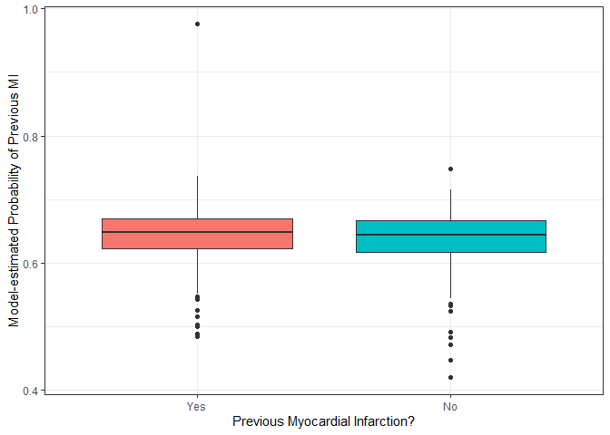
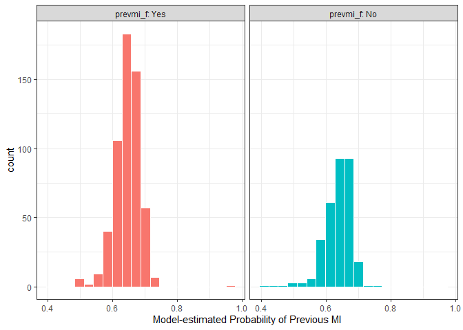
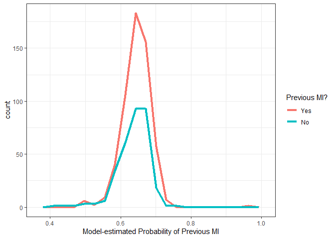
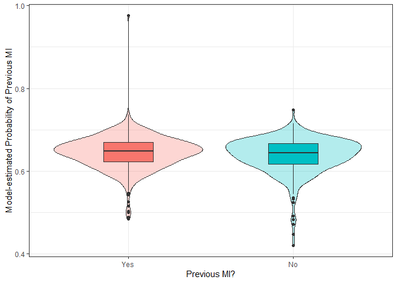

500 Homework 2 Answer Sketch
================
Thomas E. Love
due 2020-01-31 (version: 2020-01-31)

  - [Setup and Loading Packages](#setup-and-loading-packages)
  - [1. Create a sample of 1000
    subjects](#create-a-sample-of-1000-subjects)
  - [2. Create a Table 1.](#create-a-table-1.)
      - [Data Cleaning / Factor
        Labeling](#data-cleaning-factor-labeling)
      - [Summary of the Cleaned Data](#summary-of-the-cleaned-data)
      - [Resulting Table 1.](#resulting-table-1.)
  - [3. Build a logistic regression
    model.](#build-a-logistic-regression-model.)
      - [A potentially important
        tangent](#a-potentially-important-tangent)
  - [4. Redefine sample and rebuild
    Table/Model.](#redefine-sample-and-rebuild-tablemodel.)
      - [The New Sample](#the-new-sample)
      - [The New Table 1](#the-new-table-1)
      - [The New Logistic Regression
        Model](#the-new-logistic-regression-model)
  - [5. Add fitted probabilities, then plot against observed
    status.](#add-fitted-probabilities-then-plot-against-observed-status.)
      - [Adding the Fitted
        Probabilities](#adding-the-fitted-probabilities)
      - [Building a Plot](#building-a-plot)

## Setup and Loading Packages

``` r
library(tableone)
library(skimr)
library(janitor)
library(tidyverse)

theme_set(theme_bw())
```

# 1\. Create a sample of 1000 subjects

Create a sample of 1000 subjects from the `dig1.csv` data describing the
DIG study. Specify a random seed (via `set.seed`) to select your sample
of 1000 subjects. Ensure that your sample does not include any subject
who has missing information on the indicator of previous myocardial
infarction, `PREVMI`. (You may want to identify such subjects in advance
and filter them out of the dig1 data before you sample.)

So, we’ll filter out anyone with missing `PREVMI` first.

``` r
dig1_raw <- read_csv("dig1.csv") %>%
    filter(!is.na(PREVMI))
```

    Parsed with column specification:
    cols(
      .default = col_double()
    )

    See spec(...) for full column specifications.

``` r
dig1_raw %>% skim(PREVMI)
```

|                                                  |            |
| :----------------------------------------------- | :--------- |
| Name                                             | Piped data |
| Number of rows                                   | 6799       |
| Number of columns                                | 72         |
| \_\_\_\_\_\_\_\_\_\_\_\_\_\_\_\_\_\_\_\_\_\_\_   |            |
| Column type frequency:                           |            |
| numeric                                          | 1          |
| \_\_\_\_\_\_\_\_\_\_\_\_\_\_\_\_\_\_\_\_\_\_\_\_ |            |
| Group variables                                  | None       |

Data summary

**Variable type: numeric**

| skim\_variable | n\_missing | complete\_rate | mean |   sd | p0 | p25 | p50 | p75 | p100 | hist  |
| :------------- | ---------: | -------------: | ---: | ---: | -: | --: | --: | --: | ---: | :---- |
| PREVMI         |          0 |              1 | 0.65 | 0.48 |  0 |   0 |   1 |   1 |    1 | ▅▁▁▁▇ |

``` r
set.seed(500)

dig2 <- dig1_raw %>% 
    sample_n(size = 1000) %>%
    clean_names()

dig2
```

    # A tibble: 1,000 x 72
       subjectid trtmt   age  race   sex ejf_per ejfmeth chestx   bmi klevel creat
           <dbl> <dbl> <dbl> <dbl> <dbl>   <dbl>   <dbl>  <dbl> <dbl>  <dbl> <dbl>
     1      5480     1    76     1     2      37       1  0.63   25.0    4.4 1.76 
     2      6556     1    54     1     2      39       1  0.55   26.3    4.3 1.08 
     3      6576     1    76     1     1      25       3  0.65   27.3    4.7 0.9  
     4      6070     1    65     1     1      45       1  0.51   18.7   NA   1.6  
     5      4083     1    74     2     2      20       1  0.580  32.3    3.4 1.12 
     6      5290     1    63     1     1      30       1  0.62   28.3    4.5 1.5  
     7       800     1    80     1     1      16       1  0.51   23.3    5   0.955
     8      3309     1    90     2     1      37       3  0.63   21.0   NA   1.70 
     9      5168     0    70     1     1      22       2  0.48   30.3    4.1 1.02 
    10      5675     1    58     1     2      21       3  0.54   38.5    4.2 1.66 
    # ... with 990 more rows, and 61 more variables: digdoser <dbl>, chfdur <dbl>,
    #   rales <dbl>, elevjvp <dbl>, pedema <dbl>, restdys <dbl>, exertdys <dbl>,
    #   actlimit <dbl>, s3 <dbl>, pulcong <dbl>, nsym <dbl>, heartrte <dbl>,
    #   diabp <dbl>, sysbp <dbl>, functcls <dbl>, chfetiol <dbl>, prevmi <dbl>,
    #   angina <dbl>, diabetes <dbl>, hyperten <dbl>, diguse <dbl>, diuretk <dbl>,
    #   diuret <dbl>, ksupp <dbl>, aceinhib <dbl>, nitrates <dbl>, hydral <dbl>,
    #   vasod <dbl>, digdose <dbl>, cvd <dbl>, cvddays <dbl>, whf <dbl>,
    #   whfdays <dbl>, dig <dbl>, digdays <dbl>, mi <dbl>, midays <dbl>,
    #   uang <dbl>, uangdays <dbl>, strk <dbl>, strkdays <dbl>, sva <dbl>,
    #   svadays <dbl>, vena <dbl>, venadays <dbl>, crev <dbl>, crevdays <dbl>,
    #   ocvd <dbl>, ocvddays <dbl>, rinf <dbl>, rinfdays <dbl>, oth <dbl>,
    #   othdays <dbl>, hosp <dbl>, hospdays <dbl>, nhosp <dbl>, death <dbl>,
    #   deathday <dbl>, reason <dbl>, dwhf <dbl>, dwhfdays <dbl>

# 2\. Create a Table 1.

The Table 1 should describe the data according to whether or not the
subject had a previous myocardial infarction (`prevmi`) across each of
these 12 variables.

|   Variable | Description                                                    |
| ---------: | -------------------------------------------------------------- |
|    `trtmt` | Treatment group (1 = DIG, 0 = Placebo)                         |
|      `age` | Age in years                                                   |
|     `race` | White (1) or Non-White (2)                                     |
|      `sex` | Male (1) or Female (2)                                         |
|  `ejf_per` | Ejection Fraction (percent)                                    |
|   `chestx` | Chest X-ray (CT ratio)                                         |
|      `bmi` | Body-Mass Index                                                |
|   `klevel` | Serum Potassium level (mEq/l)                                  |
|    `creat` | Serum Creatinine level (mg/dl)                                 |
|   `chfdur` | Approximate Duration of CHF (mos.)                             |
| `exertdys` | Dyspnea on exertion (see note)                                 |
| `functcls` | Current NYHA Functional Class (1 = I, 2 = II, 3 = III, 4 = IV) |

Note that the `dyspnea` categories are: 0 = None or Unknown, 1 =
Present, 2 = Past, 3 = Present and Past

## Data Cleaning / Factor Labeling

Be sure to correctly represent each of the categorical variables as
factors, rather than in the numerical form they start in. Label your
factors to ease the work for the viewer, and reduce or eliminate the
need to look at a codebook. Also, be sure to accurately report whether
any missing values are observed in this sample.

*Note*: You’re going to have to do this again with a revised sample in
step 4, so it’s worth it to code this in a reproducible way.

``` r
dig2a <- dig2 %>%
    mutate(prevmi_f = fct_recode(factor(prevmi), 
                                 Yes = "1",
                                 No = "0"),
           prevmi_f = fct_relevel(prevmi_f, "Yes"),
           treat_f = fct_recode(factor(trtmt), 
                                DIG = "1",
                                Placebo = "0"),
           race_f = fct_recode(factor(race), 
                               White = "1", 
                               "Non-white" = "2"),
           race_f = fct_relevel(race_f, "Non-white"),
           sex_f = fct_recode(factor(sex),
                              F = "1",
                              M = "2"),
           sex_f = fct_relevel(sex_f, "M"),
           dyspnea_f = fct_recode(factor(exertdys),
                                  None_or_Unknown = "0",
                                  Present = "1",
                                  Past = "2",
                                  Present_and_Past = "3"),
           dyspnea_f = fct_relevel(dyspnea_f,
                                   "None_or_Unknown", 
                                   "Past", "Present"),
           nyha_f = fct_recode(factor(functcls), 
                                I = "1",
                                II = "2",
                                III = "3",
                                IV = "4")) %>%
    
    select(subjectid, prevmi, prevmi_f, treat_f, age, 
           race_f, sex_f, ejf_per, chestx, bmi, klevel, 
           creat, chfdur, dyspnea_f, nyha_f)
```

## Summary of the Cleaned Data

``` r
summary(dig2a)
```

``` 
   subjectid        prevmi      prevmi_f     treat_f         age      
 Min.   :   9   Min.   :0.000   Yes:642   Placebo:509   Min.   :27.0  
 1st Qu.:1763   1st Qu.:0.000   No :358   DIG    :491   1st Qu.:57.0  
 Median :3456   Median :1.000                           Median :64.0  
 Mean   :3444   Mean   :0.642                           Mean   :63.6  
 3rd Qu.:5126   3rd Qu.:1.000                           3rd Qu.:72.0  
 Max.   :6799   Max.   :1.000                           Max.   :92.0  
                                                                      
       race_f    sex_f      ejf_per          chestx            bmi       
 Non-white:146   M:211   Min.   : 7.00   Min.   :0.1600   Min.   :16.39  
 White    :854   F:789   1st Qu.:21.00   1st Qu.:0.4900   1st Qu.:23.68  
                         Median :28.50   Median :0.5300   Median :26.72  
                         Mean   :28.18   Mean   :0.5336   Mean   :27.31  
                         3rd Qu.:35.00   3rd Qu.:0.5700   3rd Qu.:30.05  
                         Max.   :45.00   Max.   :0.9300   Max.   :49.04  
                                                                         
     klevel            creat           chfdur                  dyspnea_f  
 Min.   :  0.000   Min.   :0.318   Min.   :  0.00   None_or_Unknown : 48  
 1st Qu.:  4.100   1st Qu.:1.034   1st Qu.:  6.00   Past            :182  
 Median :  4.300   Median :1.200   Median : 18.00   Present         :158  
 Mean   :  4.829   Mean   :1.275   Mean   : 30.44   Present_and_Past:612  
 3rd Qu.:  4.600   3rd Qu.:1.420   3rd Qu.: 40.00                         
 Max.   :434.000   Max.   :3.000   Max.   :300.00                         
 NA's   :115                       NA's   :2                              
  nyha_f   
 I   :124  
 II  :538  
 III :316  
 IV  : 21  
 NA's:  1  
           
           
```

And we can summarize the missingness in our sample of 1,000 people as:

  - 115 missing `klevel` values,
  - 2 missing `chfdur` value, and
  - 0 missing `dyspnea_f` status

## Resulting Table 1.

``` r
q2_t1 <- CreateTableOne(data = dig2a, 
                    vars = c("treat_f", "age", "race_f", 
                             "sex_f", "ejf_per", "chestx", 
                             "bmi", "klevel", "creat", 
                             "chfdur", "dyspnea_f", "nyha_f"),
                    strata = c("prevmi_f"))
q2_t1
```

``` 
                     Stratified by prevmi_f
                      Yes           No            p      test
  n                     642           358                    
  treat_f = DIG (%)     312 (48.6)    179 (50.0)   0.719     
  age (mean (SD))     63.52 (11.01) 63.75 (10.41)  0.749     
  race_f = White (%)    548 (85.4)    306 (85.5)   1.000     
  sex_f = F (%)         503 (78.3)    286 (79.9)   0.623     
  ejf_per (mean (SD)) 28.21 (8.87)  28.12 (8.71)   0.883     
  chestx (mean (SD))   0.53 (0.07)   0.53 (0.08)   0.678     
  bmi (mean (SD))     27.45 (5.33)  27.08 (5.19)   0.285     
  klevel (mean (SD))   5.08 (18.02)  4.38 (0.43)   0.487     
  creat (mean (SD))    1.27 (0.35)   1.28 (0.35)   0.854     
  chfdur (mean (SD))  31.06 (36.91) 29.35 (36.30)  0.480     
  dyspnea_f (%)                                    0.777     
     None_or_Unknown     28 ( 4.4)     20 ( 5.6)             
     Past               114 (17.8)     68 (19.0)             
     Present            103 (16.0)     55 (15.4)             
     Present_and_Past   397 (61.8)    215 (60.1)             
  nyha_f (%)                                       0.869     
     I                   82 (12.8)     42 (11.7)             
     II                 343 (53.5)    195 (54.5)             
     III                204 (31.8)    112 (31.3)             
     IV                  12 ( 1.9)      9 ( 2.5)             
```

There are lots of other things we could do here, including:

  - making decisions about Normality for each quantitative variable,
    which might then lead us to summarize some quantitative variables
    with medians and quartiles, rather than means and standard
    deviations, and using Wilcoxon rank sum rather than t tests for p
    values,
      - an interesting idea is using the `skim` function’s histograms
        after grouping the data by `prevmi_f` to scan and make these
        decisions,
      - or we could use summary applied to the tableone object and
        compare the p values we would obtain in either case (if the p
        values are similar, then the choice must not make much of a
        difference)
      - or we could work our way through a series of more serious
        Normality checks, with histograms, boxplots, Normal Q-Q plots,
        etc.
  - assessing whether an exact or approximate test might be a better
    choice for each categorical variable, but that’s a small issue.
  - another approach would have been to leave the factor variables as
    they were originally and simply specify some as factors in the call
    to CreateTableOne. That would have left us with some
    tougher-to-interpret level names and orders, though.

For now, I’ll just leave it as it is.

# 3\. Build a logistic regression model.

Build a logistic regression model for previous MI using the main effects
of the 12 variables above. I’d call the model `m1` that predicts the log
odds of previous myocardial infarction (`prevmi`) on the basis of the
main effects of each of the twelve variables in your table above, for
your sample of 1000 subjects. How many observations does your model
actually fit results for? (This is asking for the number of subjects
without any missingness, across all variables in your model.)

``` r
m1 <- glm(prevmi ~ treat_f + age + race_f + sex_f +
              ejf_per + chestx + bmi + klevel +
              creat + chfdur + dyspnea_f + nyha_f,
          data = dig2a, family = binomial(link = logit))

summary(m1)
```

``` 

Call:
glm(formula = prevmi ~ treat_f + age + race_f + sex_f + ejf_per + 
    chestx + bmi + klevel + creat + chfdur + dyspnea_f + nyha_f, 
    family = binomial(link = logit), data = dig2a)

Deviance Residuals: 
    Min       1Q   Median       3Q      Max  
-1.6620  -1.3977   0.8908   0.9468   1.2035  

Coefficients:
                            Estimate Std. Error z value Pr(>|z|)
(Intercept)               -0.8956410  1.0931428  -0.819    0.413
treat_fDIG                 0.0266460  0.1429245   0.186    0.852
age                        0.0011428  0.0066192   0.173    0.863
race_fWhite                0.0784478  0.2085643   0.376    0.707
sex_fF                    -0.0425153  0.1776119  -0.239    0.811
ejf_per                    0.0050379  0.0085161   0.592    0.554
chestx                     0.8881697  1.0512439   0.845    0.398
bmi                        0.0140790  0.0136350   1.033    0.302
klevel                     0.0073309  0.0150373   0.488    0.626
creat                      0.0873618  0.2105707   0.415    0.678
chfdur                     0.0009937  0.0019128   0.519    0.603
dyspnea_fPast              0.0950069  0.3561948   0.267    0.790
dyspnea_fPresent           0.2425484  0.3653183   0.664    0.507
dyspnea_fPresent_and_Past  0.2805513  0.3296310   0.851    0.395
nyha_fII                  -0.0283880  0.2227002  -0.127    0.899
nyha_fIII                 -0.0318192  0.2392043  -0.133    0.894
nyha_fIV                  -0.6687990  0.5226770  -1.280    0.201

(Dispersion parameter for binomial family taken to be 1)

    Null deviance: 1151.8  on 882  degrees of freedom
Residual deviance: 1145.1  on 866  degrees of freedom
  (117 observations deleted due to missingness)
AIC: 1179.1

Number of Fisher Scoring iterations: 5
```

The sample size used by this model is 872 subjects. We know this because
the output tells us that 128 of our original 1000 observations were
deleted due to missingness, or because the null deviance is associated
with 871 degrees of freedom, and the null deviance will always be
associated with n - 1 degrees of freedom, where n is the number of
observations actually used to fit the model.

  - Another way of determining the number of observations with complete
    data across all variables in the `dig2a` data is to use `count` and
    `complete.cases` like this:

<!-- end list -->

``` r
dig2a %>% count(complete.cases(.))
```

    # A tibble: 2 x 2
      `complete.cases(.)`     n
      <lgl>               <int>
    1 FALSE                 117
    2 TRUE                  883

## A potentially important tangent

When fitting a logistic regression model in R, how do you know which
level of your binary response (1 or 0, Yes or No, etc.) is being
predicted by the `glm`?

Let’s show a simple case.

``` r
toy1 <- dig2a %>% select(prevmi, prevmi_f, treat_f, bmi)

toy_modelA <- glm(prevmi ~ treat_f + bmi, 
                  data = toy1, 
                  family = binomial(link = logit))

toy_modelB <- glm(prevmi_f ~ treat_f + bmi, 
                  data = toy1, 
                  family = binomial(link = logit))

toy_modelA
```

``` 

Call:  glm(formula = prevmi ~ treat_f + bmi, family = binomial(link = logit), 
    data = toy1)

Coefficients:
(Intercept)   treat_fDIG          bmi  
    0.24673     -0.04604      0.01321  

Degrees of Freedom: 999 Total (i.e. Null);  997 Residual
Null Deviance:      1305 
Residual Deviance: 1303     AIC: 1309
```

``` r
toy_modelB
```

``` 

Call:  glm(formula = prevmi_f ~ treat_f + bmi, family = binomial(link = logit), 
    data = toy1)

Coefficients:
(Intercept)   treat_fDIG          bmi  
   -0.24673      0.04604     -0.01321  

Degrees of Freedom: 999 Total (i.e. Null);  997 Residual
Null Deviance:      1305 
Residual Deviance: 1303     AIC: 1309
```

As you can see, the coefficients in `toy_modelA` are the negative of the
coefficients in `toy_modelB`. This is because one of the models (model
A, as it turns out) is estimating Pr(Previous MI) and one (model B, as
it turns out) is estimating Pr(No previous MI). How do we know for sure
which is which?

  - R, by default for a logistic regression using `glm`, wants a numeric
    response with 1 for “success” and 0 for “failure” and it will fit a
    model to predict the probability of “success”.
  - For logistic regression models, `glm` will also accept a factor
    response, where the first level denotes “failure” and all other
    levels denote “success”.

In general…

  - if we use a 1/0 numeric outcome like `PREVMI`, we will get Pr(PREVMI
    = 1) from our model.
  - if we use a factor outcome like `prevmi_f`, we should look at the
    order of the levels - whatever is first will be treated as “failure”
    and the rest as “success”, and we will get Pr(“success”) from our
    model.

To check the levels of a factor, we can use `levels` or `table`, for
example.

``` r
levels(toy1$prevmi_f)
```

    [1] "Yes" "No" 

``` r
table(toy1$prevmi_f)
```

``` 

Yes  No 
642 358 
```

Here, in either case, we see the problem, which is that we’ve specified
“Yes” as the first level and “No” as the second level. So our model
fits the probability of “No”. We could change this order back using
`fct_relevel` if we like. Note that the order we wanted in Table 1 is
the opposite of what we want for modeling.

Sometimes, people try using a logical response, like this, to deal with
a factor variable.

``` r
toy_modelC <- glm((prevmi_f == "Yes") ~ treat_f + bmi, 
                  data = toy1, 
                  family = binomial(link = logit))

toy_modelC
```

``` 

Call:  glm(formula = (prevmi_f == "Yes") ~ treat_f + bmi, family = binomial(link = logit), 
    data = toy1)

Coefficients:
(Intercept)   treat_fDIG          bmi  
    0.24673     -0.04604      0.01321  

Degrees of Freedom: 999 Total (i.e. Null);  997 Residual
Null Deviance:      1305 
Residual Deviance: 1303     AIC: 1309
```

As you can see this works, because the logical variable `(prevmi_f ==
"Yes")` places FALSE before TRUE, and so R’s `glm` function models the
probability that the statement `(prevmi_f == "Yes")` is TRUE.

``` r
table(toy1$prevmi_f == "Yes")
```

``` 

FALSE  TRUE 
  358   642 
```

# 4\. Redefine sample and rebuild Table/Model.

Assuming you have at least one missing value in a predictor in your
model for question 3, re-define your sample to include only the
observations which are “complete cases” with no missingness on any of
the key variables we’re looking at. Specify the number of subjects (\<
1000) that remain in your new sample.

Now, **redo both Tasks 2 and 3** to describe this new sample and use it
to fit a model. Call the new model `m2`. Verify that no missingness
plagues this new model.

## The New Sample

We’ll build a new `dig2b` that limits us to the 872 cases with complete
data.

``` r
dig2b <- dig2a %>% drop_na

nrow(dig2b)
```

    [1] 883

## The New Table 1

Here’s the new Table 1, restricted to these 883 people.

``` r
q4_t1 <- CreateTableOne(data = dig2b, 
                    vars = c("treat_f", "age", "race_f", 
                             "sex_f", "ejf_per", "chestx", 
                             "bmi", "klevel", "creat", 
                             "chfdur", "dyspnea_f", 
                             "nyha_f"),
                    strata = c("prevmi_f"))
q4_t1
```

``` 
                     Stratified by prevmi_f
                      Yes           No            p      test
  n                     567           316                    
  treat_f = DIG (%)     281 (49.6)    156 (49.4)   1.000     
  age (mean (SD))     63.69 (10.97) 63.68 (10.47)  0.990     
  race_f = White (%)    485 (85.5)    270 (85.4)   1.000     
  sex_f = F (%)         440 (77.6)    249 (78.8)   0.744     
  ejf_per (mean (SD)) 28.27 (8.81)  27.86 (8.83)   0.505     
  chestx (mean (SD))   0.53 (0.07)   0.53 (0.08)   0.528     
  bmi (mean (SD))     27.47 (5.38)  27.11 (5.05)   0.325     
  klevel (mean (SD))   5.08 (18.05)  4.38 (0.43)   0.486     
  creat (mean (SD))    1.27 (0.34)   1.26 (0.34)   0.600     
  chfdur (mean (SD))  31.90 (38.13) 30.07 (37.13)  0.490     
  dyspnea_f (%)                                    0.682     
     None_or_Unknown     25 ( 4.4)     17 ( 5.4)             
     Past               100 (17.6)     64 (20.3)             
     Present             87 (15.3)     47 (14.9)             
     Present_and_Past   355 (62.6)    188 (59.5)             
  nyha_f (%)                                       0.654     
     I                   72 (12.7)     39 (12.3)             
     II                 303 (53.4)    167 (52.8)             
     III                183 (32.3)    101 (32.0)             
     IV                   9 ( 1.6)      9 ( 2.8)             
```

## The New Logistic Regression Model

And here’s the new model:

``` r
m2 <- glm(prevmi ~ treat_f + age + race_f + sex_f +
              ejf_per + chestx + bmi + klevel +
              creat + chfdur + dyspnea_f + nyha_f,
          data = dig2b, family = binomial(link = logit))

summary(m2)
```

``` 

Call:
glm(formula = prevmi ~ treat_f + age + race_f + sex_f + ejf_per + 
    chestx + bmi + klevel + creat + chfdur + dyspnea_f + nyha_f, 
    family = binomial(link = logit), data = dig2b)

Deviance Residuals: 
    Min       1Q   Median       3Q      Max  
-1.6620  -1.3977   0.8908   0.9468   1.2035  

Coefficients:
                            Estimate Std. Error z value Pr(>|z|)
(Intercept)               -0.8956410  1.0931428  -0.819    0.413
treat_fDIG                 0.0266460  0.1429245   0.186    0.852
age                        0.0011428  0.0066192   0.173    0.863
race_fWhite                0.0784478  0.2085643   0.376    0.707
sex_fF                    -0.0425153  0.1776119  -0.239    0.811
ejf_per                    0.0050379  0.0085161   0.592    0.554
chestx                     0.8881697  1.0512439   0.845    0.398
bmi                        0.0140790  0.0136350   1.033    0.302
klevel                     0.0073309  0.0150373   0.488    0.626
creat                      0.0873618  0.2105707   0.415    0.678
chfdur                     0.0009937  0.0019128   0.519    0.603
dyspnea_fPast              0.0950069  0.3561948   0.267    0.790
dyspnea_fPresent           0.2425484  0.3653183   0.664    0.507
dyspnea_fPresent_and_Past  0.2805513  0.3296310   0.851    0.395
nyha_fII                  -0.0283880  0.2227002  -0.127    0.899
nyha_fIII                 -0.0318192  0.2392043  -0.133    0.894
nyha_fIV                  -0.6687990  0.5226770  -1.280    0.201

(Dispersion parameter for binomial family taken to be 1)

    Null deviance: 1151.8  on 882  degrees of freedom
Residual deviance: 1145.1  on 866  degrees of freedom
AIC: 1179.1

Number of Fisher Scoring iterations: 5
```

There’s no missingness here, and our model uses all 883 complete
observations, as we can see from the null deviance DF (which is n - 1).

# 5\. Add fitted probabilities, then plot against observed status.

Use the model (`m2`) you built in Task 4 to add the fitted probability
of previous myocardial infarction to your sample used to create `m2`.
Produce an attractive and useful graphical summary of the distribution
of fitted probabilities of previous myocardial infarction broken down
into two categories by the patient’s actual `prevmi` status in this
sample. I suggest rounding the probabilities to two decimal places
before graphing.

## Adding the Fitted Probabilities

There are several ways to add the fitted probabilities back to the data.
You might use:

``` r
dig2b$m2fits <- predict(m2, type = "response")

dig2b %>% skim(m2fits)
```

|                                                  |            |
| :----------------------------------------------- | :--------- |
| Name                                             | Piped data |
| Number of rows                                   | 883        |
| Number of columns                                | 16         |
| \_\_\_\_\_\_\_\_\_\_\_\_\_\_\_\_\_\_\_\_\_\_\_   |            |
| Column type frequency:                           |            |
| numeric                                          | 1          |
| \_\_\_\_\_\_\_\_\_\_\_\_\_\_\_\_\_\_\_\_\_\_\_\_ |            |
| Group variables                                  | None       |

Data summary

**Variable type: numeric**

| skim\_variable | n\_missing | complete\_rate | mean |   sd |   p0 |  p25 |  p50 |  p75 | p100 | hist  |
| :------------- | ---------: | -------------: | ---: | ---: | ---: | ---: | ---: | ---: | ---: | :---- |
| m2fits         |          0 |              1 | 0.64 | 0.04 | 0.42 | 0.62 | 0.65 | 0.67 | 0.98 | ▁▆▇▁▁ |

Or you might use the `augment` tool from the `broom` package:

``` r
dig3 <- broom::augment(m2, type.predict = "response")

dig3 %>% skim(.fitted)
```

|                                                  |            |
| :----------------------------------------------- | :--------- |
| Name                                             | Piped data |
| Number of rows                                   | 883        |
| Number of columns                                | 20         |
| \_\_\_\_\_\_\_\_\_\_\_\_\_\_\_\_\_\_\_\_\_\_\_   |            |
| Column type frequency:                           |            |
| numeric                                          | 1          |
| \_\_\_\_\_\_\_\_\_\_\_\_\_\_\_\_\_\_\_\_\_\_\_\_ |            |
| Group variables                                  | None       |

Data summary

**Variable type: numeric**

| skim\_variable | n\_missing | complete\_rate | mean |   sd |   p0 |  p25 |  p50 |  p75 | p100 | hist  |
| :------------- | ---------: | -------------: | ---: | ---: | ---: | ---: | ---: | ---: | ---: | :---- |
| .fitted        |          0 |              1 | 0.64 | 0.04 | 0.42 | 0.62 | 0.65 | 0.67 | 0.98 | ▁▆▇▁▁ |

In either case, you need to specify “response” as the type of prediction
you want in order to get fitted probabilities of previous MI, rather
than the logit of those probabilities.

## Building a Plot

As for a graphical summary - I’d be happy with anything that permitted
easy comparison of the two density estimates. Options shown below
include a comparison boxplot, facetted histograms, frequency polygons,
and a violin plot.

``` r
ggplot(dig2b, aes(x = prevmi_f, y = m2fits, fill = prevmi_f)) +
    geom_boxplot() +
    guides(fill = FALSE) +
    labs(x = "Previous Myocardial Infarction?",
         y = "Model-estimated Probability of Previous MI")
```

<!-- -->

``` r
ggplot(dig2b, aes(x = m2fits, fill = prevmi_f)) +
    geom_histogram(bins = 20, col = "white") +
    guides(fill = FALSE) +
    labs(x = "Model-estimated Probability of Previous MI") +
    facet_wrap(~ prevmi_f, labeller = label_both)
```

<!-- -->

``` r
ggplot(dig2b, aes(x = m2fits, col = prevmi_f)) +
    geom_freqpoly(bins = 20, size = 1.5) +
    scale_color_discrete(name = "Previous MI?") +
    labs(x = "Model-estimated Probability of Previous MI") 
```

<!-- -->

``` r
ggplot(dig2b, aes(x = prevmi_f, y = m2fits, fill = prevmi_f)) +
    geom_violin(alpha = 0.3) +
    geom_boxplot(width = 0.3) +
    guides(fill = FALSE) +
    labs(x = "Previous MI?",
         y = "Model-estimated Probability of Previous MI") 
```

<!-- -->
